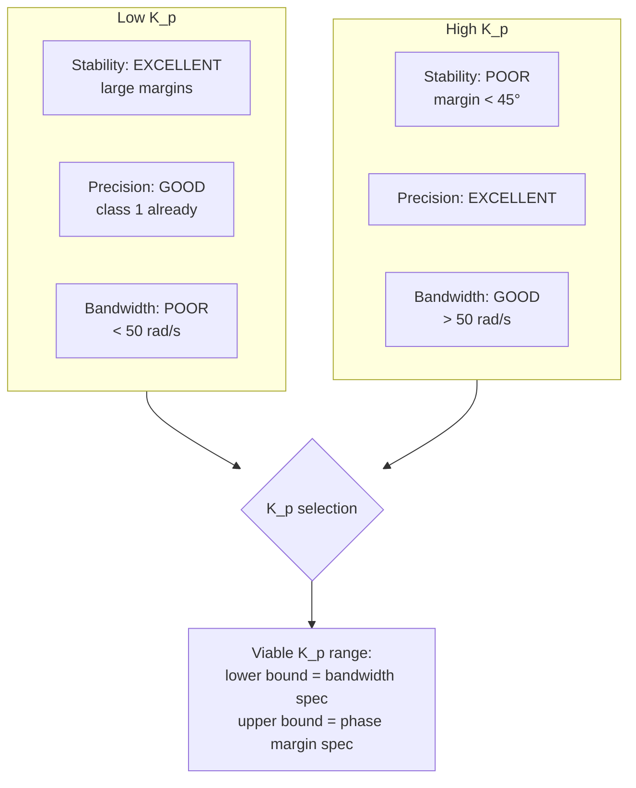
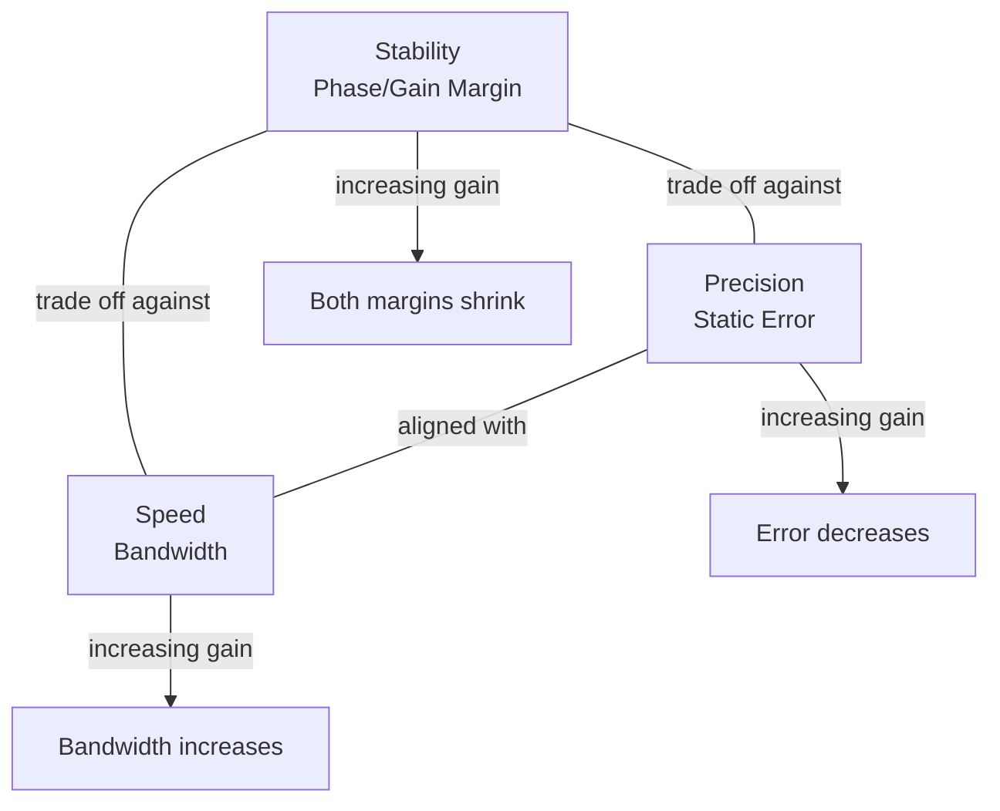

# DELTA Robot Gripper Orientation: The Stability-Precision-Speed Trilemma

## Executive Summary

A DELTA robot's gripper orientation axis uses a nested servo control architecture — an inner velocity loop and an outer position loop — to precisely orient a tool in 3D space. This analysis models the DC motor, derives the open-loop transfer function, and designs a proportional controller to meet performance specifications. The central insight is the **stability-precision-speed trilemma**: increasing controller gain improves precision (reduces static error) and speed (increases bandwidth) but simultaneously erodes stability margins. The engineer's task is to find the gain range where all three requirements coexist — or recognize when a simple proportional controller is insufficient and a more advanced corrector (PI, phase-lead) is needed.

---

## 1. System Context

### What is a DELTA robot?

A DELTA robot is a parallel-arm manipulator widely used in high-speed pick-and-place operations — electronics assembly, food packaging, pharmaceutical sorting. Its three translational arms position a platform in XYZ, while a **fourth axis** — a telescopic shaft with dual Cardan joints passing through the center — controls the gripper's rotation about the vertical axis.

```mermaid
flowchart TD
    User[User Input<br>θ_c setpoint] --> Converter[Angle-to-Voltage<br>Converter K_pot]
    Converter --> Sum1((Σ))
    Sum1 -->|ε_pos| C[Position Controller<br>C(p)]
    C --> Sum2((Σ))
    Sum2 -->|ε_vel| A[Amp Gain<br>A]
    A -->|U_m| Motor[DC Motor<br>H_m(p)]
    Motor -->|Ω_m| Reducer[Reducer<br>1/N]
    Reducer -->|Ω_cardan| Cardan[Cardan Joints<br>T(p)=1]
    Cardan -->|θ_p| Output[Gripper Angle θ_p]
    
    Motor -->|Ω_m| Tacho[Tachometer<br>K_ω]
    Tacho -->|U_ω| Sum2
    Motor -->|Ω_m| Integrator[1/p]
    Integrator -->|θ_m| EncoderConv[Encoder + DAC<br>K_pos]
    EncoderConv -->|U_θ| Sum1
```

The architecture uses **cascade control**:
- **Inner loop (tachometric):** Velocity feedback via tachometer — stabilizes the motor, improves damping
- **Outer loop (position):** Angular position feedback via incremental encoder — ensures zero static error and tracking accuracy

### Performance specifications

| Requirement | Criterion | Target |
|------------|-----------|--------|
| Stability | Phase margin $M_\varphi$ | $\geq 45°$ |
| Stability | Gain margin $M_G$ | $\geq 10$ dB |
| Precision | Static error $\varepsilon_s$ | $= 0$ |
| Speed | 0 dB bandwidth $\omega_0$ | $\geq 50$ rad/s |

---

## 2. DC Motor Modeling

### Physical equations

The servo-drive uses a DC motor with the standard model:

**Electrical:**
$$U_m(t) = e(t) + R \cdot i(t) + L \cdot \frac{di(t)}{dt}$$

**Electromechanical coupling:**
$$e(t) = K_e \cdot \omega_m(t) \quad \text{(back-EMF)}$$
$$C_m(t) = K_c \cdot i(t) \quad \text{(motor torque)}$$

**Mechanical (PFD applied to rotor + reflected load):**
$$J \cdot \frac{d\omega_m(t)}{dt} = C_m(t)$$

### Numerical parameters

| Parameter | Symbol | Value | Unit |
|-----------|--------|-------|------|
| Back-EMF constant | $K_e$ | 0.0143 | V/(rad/s) |
| Torque constant | $K_c$ | 0.137 | N·m/A |
| Armature resistance | $R$ | 1.0 | Ω |
| Armature inductance | $L$ | 1.65 × 10⁻³ | H |
| Rotor + load inertia | $J$ | 12 × 10⁻⁵ | kg·m² |
| Reducer ratio | $N$ | 0.2 | — |
| Tachometer gain | $K_\omega$ | 0.006 | V/(rad/s) |
| Position sensor gain | $K_{pos}$ | 0.01 | V/rad |

### Motor transfer function

Taking the Laplace transform and eliminating $i(t)$:

$$H_m(p) = \frac{\Omega_m(p)}{U_m(p)} = \frac{K_c}{K_e K_c + R J p + L J p^2}$$

With the numerical values, the electrical time constant $\tau_e = L/R = 1.65$ ms is negligible compared to the mechanical dynamics — the motor behaves as a **first-order system**:

$$H_m(p) \approx \frac{K_m}{1 + \tau_m p}$$

where $K_m$ is the motor gain and $\tau_m$ the mechanical time constant.

---

## 3. Tachometric Inner Loop

### Purpose

The tachometer measures motor speed $\omega_m(t)$ and feeds back a proportional voltage $U_\omega(t) = K_\omega \cdot \omega_m(t)$. This inner loop:
- Increases the system's **damping** (adds derivative action to the position loop)
- Reduces sensitivity to motor parameter variations
- Linearizes the motor response

### Amplifier gain design

The amplifier gain $A$ is chosen to achieve a **minimum 5% settling time** for the inner loop's step response. For a first-order system, the 5% settling time is:

$$t_{r5\%} = 3\tau$$

The closed-loop time constant $\tau_{CL}$ depends on $A$ — higher gain reduces the time constant (faster response) but increases sensitivity to noise and risks saturating the amplifier. The optimal $A$ balances these factors.

---

## 4. Position Loop: Uncorrected Analysis

### Open-loop transfer function

With the inner loop closed and $C(p) = 1$ (no correction), the position open-loop transfer function reduces to:

$$FTBO(p) = \frac{K_{pos}}{p} \cdot \frac{A \cdot H_m(p)}{1 + A \cdot H_m(p) \cdot K_\omega p}$$

After simplification with the numerical parameters:

$$FTBO(p) = \frac{\alpha}{p(103 + 3.2 \times 10^{-3} p + 5.3 \times 10^{-6} p^2)}$$

where $\alpha$ is a constant incorporating all gain terms.

### Bode diagram analysis

Plotting the asymptotic Bode diagram reveals:

**Low frequencies ($p \to 0$):**
$$FTBO(p) \approx \frac{\alpha}{103 p} \quad \Rightarrow \quad \text{slope: } -20 \text{ dB/dec}, \quad \text{phase: } -90°$$

The integrator ($1/p$) guarantees **zero static error** for a step input — the precision requirement is satisfied inherently by the system's class (class 1).

**Mid and high frequencies:**
The second-order denominator introduces a -40 dB/dec roll-off and additional phase lag. At the 0 dB crossing pulsation $\omega_{0dB}$, the phase lag determines stability margins.

### Performance diagnosis

| Metric | Uncorrected Value | Spec | Status |
|--------|------------------|------|--------|
| Phase margin $M_\varphi$ | $\ll 45°$ (likely unstable or marginally stable) | $\geq 45°$ | FAIL |
| Gain margin $M_G$ | Low | $\geq 10$ dB | FAIL |
| Bandwidth $\omega_0$ | $\ll 50$ rad/s | $\geq 50$ rad/s | FAIL |
| Static error | 0 (class 1) | 0 | PASS |

The uncorrected system is **unstable or severely underdamped**. Precision is the only spec that passes — and that's because the integrator guarantees it, not because the system is well-designed.

---

## 5. Proportional Correction: Finding the Viable Range

### Why proportional correction first?

A proportional controller $C(p) = K_p$ is the simplest correction. It shifts the Bode magnitude curve vertically without changing phase:

- **Increasing $K_p$:** Raises gain → improves bandwidth (speed) and reduces static error further (precision) → but pushes the 0 dB crossing to higher frequencies where phase lag is greater → **reduces stability margins**
- **Decreasing $K_p$:** Lowers gain → improves stability margins → but reduces bandwidth, making the system slower

### The trilemma quantified



### Finding the viable $K_p$ range

The gain $K_p$ must satisfy two inequalities simultaneously:

1. **Bandwidth constraint (lower bound):** $K_p \geq K_{p,min}$ such that $\omega_{0dB} \geq 50$ rad/s
2. **Stability constraint (upper bound):** $K_p \leq K_{p,max}$ such that $M_\varphi \geq 45°$

From the Bode diagram, each constraint maps to a specific gain value. If the two conditions overlap, a viable range exists. If not — i.e., $K_{p,min} > K_{p,max}$ — then a proportional controller alone **cannot** meet all specifications, and a more advanced corrector (PI or phase-lead) must be introduced.

### The engineering judgment

For a DELTA robot performing high-speed pick-and-place, speed is often the binding constraint — cycle time directly determines throughput. If a simple proportional controller cannot simultaneously deliver stability and speed, the standard escalation path is:

| Corrector | What it adds | When to use |
|-----------|-------------|------------|
| P (proportional) | Gain scaling | Margins already sufficient, just need more bandwidth |
| PI (proportional-integral) | Zero steady-state error + improved low-frequency gain | Precision is the bottleneck |
| Phase-lead | Phase boost near crossover | Phase margin is the bottleneck — **most likely for this system** |

---

## 6. The Stability-Precision-Speed Trilemma: General Principle

This DELTA robot analysis illustrates a universal control engineering pattern:

$$
\text{Stability} \uparrow \iff \text{Precision} \downarrow \text{ and Speed} \downarrow
$$



**Why the trilemma exists:**

- Increasing gain raises the Bode magnitude curve → pushes 0 dB crossing to higher frequencies → more phase lag at crossover → lower phase margin (stability ↓)
- But higher gain also increases the low-frequency magnitude → higher loop gain → smaller errors (precision ↑)
- And higher gain extends the bandwidth (speed ↑)

This is not a bug — it is the fundamental constraint that makes control engineering a design discipline rather than pure mathematics.

---

## 7. Engineering Conclusion

### What this analysis demonstrates

The DELTA robot gripper axis is a clean example of **cascade servo control** — an architecture used in robotics, CNC machines, antenna trackers, and countless other positioning systems. The analysis shows:

1. How nested loops (velocity inner, position outer) decompose a complex control problem into manageable layers
2. How to derive motor transfer functions from physical parameters
3. How to read stability, precision, and speed from a Bode diagram
4. How proportional correction shifts the performance balance — and why it sometimes isn't enough
5. How to identify when a more advanced corrector (phase-lead) is required

### The sales engineer's translation

When discussing a servo-driven product with a customer:

> "The controller's gain setting represents a deliberate choice on the stability-precision-speed frontier. If you need faster cycle times, we can increase the gain — but that narrows the stability margin. If the payload or operating conditions vary significantly, we recommend a phase-lead corrector that boosts phase margin at the crossover frequency without sacrificing bandwidth. The cost is slightly more complex tuning, but the performance envelope is wider."

---

## Appendix: Mathematical Derivations

### A.1 Motor Transfer Function

From the electrical equation in Laplace domain:

$$U_m(p) = K_e \Omega_m(p) + (R + Lp) I(p)$$

From the torque coupling and mechanical equation:

$$K_c I(p) = J p \Omega_m(p)$$

Eliminating $I(p)$:

$$\Omega_m(p) = \frac{K_c}{K_e K_c + R J p + L J p^2} \cdot U_m(p)$$

With $L \ll R$ (fast electrical dynamics):

$$\boxed{H_m(p) = \frac{\Omega_m(p)}{U_m(p)} \approx \frac{1/K_e}{1 + \frac{RJ}{K_e K_c}p}}$$

### A.2 Inner Loop Closed-Loop Transfer Function

With amplifier gain $A$ and tachometer feedback $K_\omega$:

$$FTBF_{inner}(p) = \frac{A \cdot H_m(p)}{1 + A \cdot H_m(p) \cdot K_\omega p}$$

### A.3 Position Open-Loop Transfer Function

The outer loop includes the integrator ($1/p$), position feedback ($K_{pos}$), reducer ($1/N$), and the inner closed loop:

$$FTBO(p) = \frac{K_{pos}}{p} \cdot FTBF_{inner}(p) \cdot \frac{1}{N}$$

This is a **class 1** system (one integrator) — the -20 dB/dec low-frequency slope guarantees zero static error for a step position command.

---

## References

- DELTA parallel robot kinematic and dynamic analysis — public research literature (Clavel, EPFL)
- DC motor servo drive design — standard control engineering references
- Bode stability analysis and corrector design — frequency-domain methods
- Cascade control architecture for positioning systems — industrial automation practice

---

*Part of the [Industrial Systems Analysis](../) series by [@julietteC06](https://github.com/julietteC06)*
