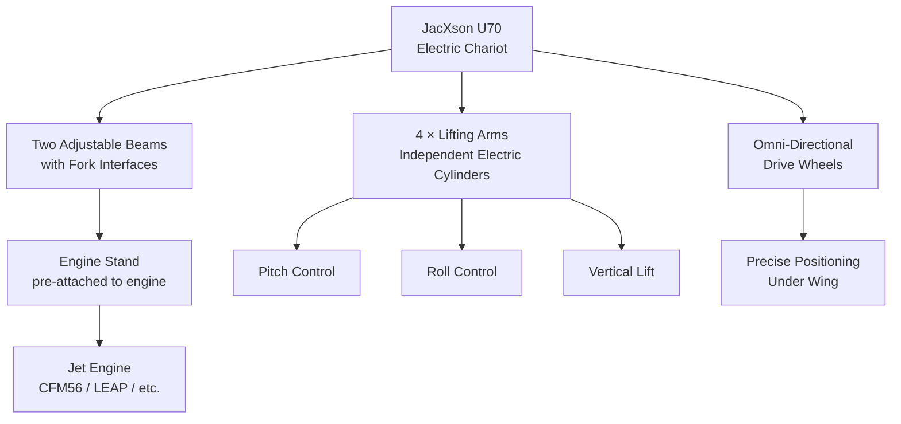
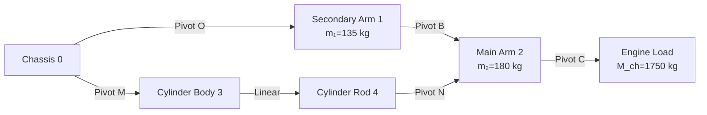
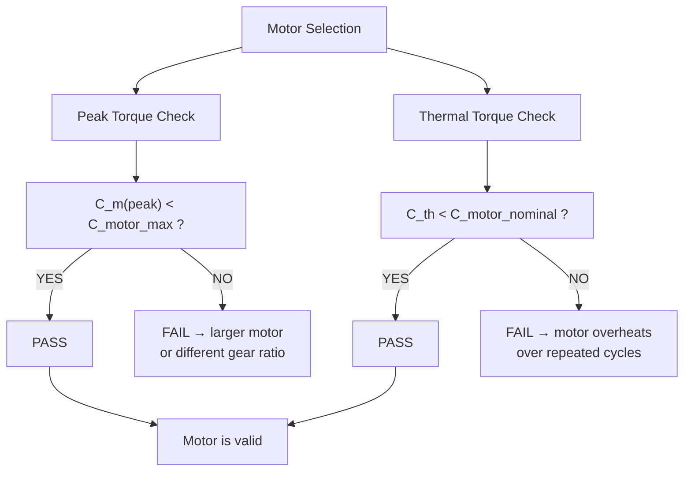
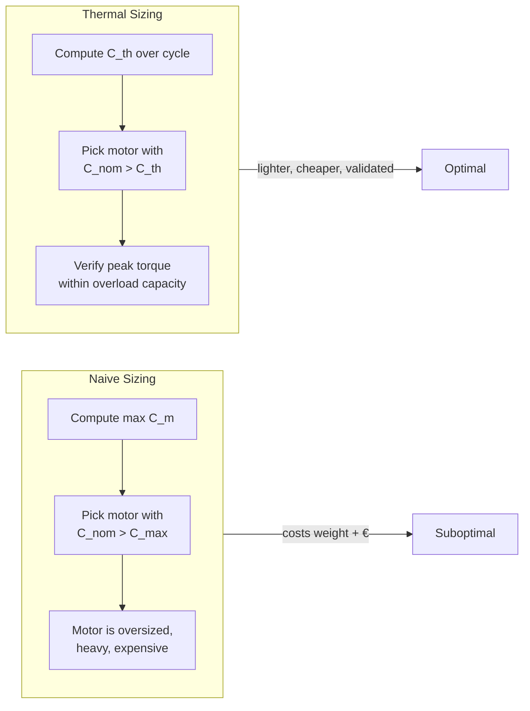

# JacXson U70: Motor Sizing for an Aircraft Engine Maintenance Chariot

## Executive Summary

The JacXson U70 is a precision electric chariot designed by EXCENT Group (Toulouse, France) for installing and removing jet engines on narrow-body aircraft. It replaces the traditional method — chain hoists suspended from scaffolding, manually operated by multiple technicians — with a single-operator, remote-controlled platform. This analysis focuses on **validating the electric cylinder motor** through the kinetic energy theorem: modeling the lifting mechanism's inertia, computing the peak startup torque and thermal equivalent torque over a duty cycle, and verifying the motor selection against both instantaneous and thermal limits. The central insight is that **motor sizing is not determined by peak load alone** — repetitive duty cycles impose a thermal constraint that often dictates the final choice.

---

## 1. System Context

### The maintenance problem

Aircraft engine maintenance is a major operating cost for airlines — roughly 10% of total operating expenditure. Every 6–7 years, each engine undergoes a deep overhaul requiring complete removal from the aircraft. The traditional process:

- Technicians erect scaffolding around the engine nacelle
- Chain hoists are suspended from the scaffold
- Multiple operators manually coordinate lifting and lowering
- The engine — weighing several tons — must be precisely aligned with mounting points

This is slow, physically dangerous, and risks damaging a multi-million-dollar engine through misalignment.

### The JacXson U70 solution



**Key product claims (EXCENT Group):**
- Significant time savings → reduced maintenance cost
- Improved operator safety and ergonomics
- Reduced risk of engine damage during handling
- Single-operator remote control via touchscreen interface
- Compatible with Airbus A220/A320, Boeing B737, Embraer E-Jet families

---

## 2. System Architecture

### Lifting mechanism

Each of the four lifting arms consists of three rigid bodies:



**Geometric parameters:**
| Parameter | Value |
|-----------|-------|
| Arm segment length $L = OB = AB = BC$ | 850 mm |
| Secondary arm CG offset $a_1$ | 430 mm |
| Main arm CG offset $a_2$ | 236 mm |
| Motor moment of inertia $J_m$ | (catalog value) |

### Electric cylinder architecture

Each lifting arm is actuated by an electric cylinder containing:

```
┌─────────────────────────────────────────┐
│  Electric Cylinder (Vérin Électrique)   │
│  ┌──────────┐  ┌──────────┐  ┌────────┐ │
│  │ DC Motor │→│ Reducer  │→│ Ball   │ │
│  │  + Brake │  │ (gear)   │  │ Screw  │ │
│  └──────────┘  └──────────┘  └────────┘ │
│                      ↓                  │
│              Linear motion of rod (4)    │
│              relative to body (3)        │
└─────────────────────────────────────────┘
```

The brake is a **power-off brake** (frein à manque de courant) — it engages when power is lost, preventing the engine from dropping. This is a critical safety feature.

---

## 3. Kinetic Energy Theorem: Motor Torque Model

### Why the kinetic energy approach?

For a multi-body mechanism with varying geometry (the arm angle $\theta(t)$ changes throughout the lift), the **Principle of Virtual Work** or **Lagrange equations** would be the formal approach. The **kinetic energy theorem** (TEC) provides a direct energy-based method that is simpler to apply and yields the same result for a system with ideal constraints:

$$\frac{d}{dt}T_{\Sigma/0} = \sum P_{ext} + \sum P_{int}$$

Where $T_{\Sigma/0}$ is the total kinetic energy of the system $\Sigma$ (all moving parts) relative to the chassis frame $R_0$.

### Energy contributions

The total kinetic energy decomposes as:

$$T_{\Sigma/0} = \underbrace{T_{1/0}}_{\text{secondary arm}} + \underbrace{T_{2/0}}_{\text{main arm}} + \underbrace{T_{M_{ch}/0}}_{\text{engine load}} + \underbrace{T_{mot/0}}_{\text{motor rotor}}$$

Each contribution is expressed as $\frac{1}{2} J_i \dot{\theta}^2$ (or $\frac{1}{2} J_i \omega_m^2$), where $J_i$ is the **equivalent moment of inertia** reflected to the motor shaft.

### Equivalent inertia — the key concept

The varying geometry means the equivalent inertia is **configuration-dependent**:

$$J_\Sigma(t) = J_1 + J_2(\theta(t)) + J_{M_{ch}}(\theta(t)) + J_m \cdot \frac{1}{k^2(t)}$$

Where $k(t) = \dot{\theta}(t)/\omega_m(t)$ is the kinematic ratio between arm angular velocity and motor angular velocity. This ratio varies with arm angle — the same motor speed produces different arm speeds at different positions.

### Power balance

The motor torque $C_m(t)$ must overcome three terms:

$$C_m(t) = \underbrace{J_\Sigma(t) \frac{d\omega_m}{dt}}_{\text{acceleration}} + \underbrace{\frac{1}{2} \frac{dJ_\Sigma(t)}{dt} \omega_m(t)}_{\text{varying inertia}} - \underbrace{C_{pes}(t)}_{\text{gravity}}$$

Where:
- **Acceleration term:** Inertial torque — dominates during startup and speed changes
- **Varying inertia term:** Arises because $J_\Sigma$ changes with arm angle — even at constant speed, changing geometry requires torque
- **Gravity term:** The 1750 kg engine load creates a position-dependent gravitational torque

---

## 4. Motor Validation: Two Constraints

### Peak torque (startup)

At $t = 0$, with the arm at its lowest position ($\theta$ near maximum) and accelerating from rest:

$$C_m(0) = J_\Sigma(0) \cdot \frac{d\omega_m}{dt}\bigg|_{t=0} - C_{pes}(0)$$

The gravity term is largest at the lowest position (maximum moment arm), and the acceleration must overcome the static inertia of the full system. The motor's **peak torque rating** must exceed this value.

The simulation curves show the startup torque is **significantly higher** than the constant-speed torque — confirming that the acceleration and varying-inertia terms dominate during transients.

### Thermal equivalent torque (duty cycle)

Over repeated lifting cycles, the motor heats up. The **thermal equivalent torque** $C_{th}$ captures the RMS effect of the varying torque profile:

$$C_{th} = \sqrt{\frac{\sum T_i C_i^2}{T_{cycle}}}$$

Where $T_i$ are time intervals and $C_i$ the corresponding torque values.

```python
def Ctherm(C, t):
    """
    Compute thermal equivalent torque from sampled torque and time arrays.

    C : list/array — torque values [N·m]
    t : list/array — time instants [s]
    returns: C_th [N·m]
    """
    total = 0.0
    for i in range(len(t) - 1):
        dt = t[i+1] - t[i]
        C_avg_sq = ((C[i] + C[i+1]) / 2) ** 2
        total += dt * C_avg_sq
    T_cycle = t[-1] - t[0]
    return (total / T_cycle) ** 0.5
```

**Execution result: $C_{th} = 2.34$ N·m**

### The dual constraint



The motor's **nominal torque** must exceed $C_{th} = 2.34$ N·m, and its **peak torque** must exceed the maximum $C_m(t)$ during the duty cycle. A motor that meets only one constraint is invalid.

---

## 5. The Core Tradeoff: Motor Sizing is a Thermal Problem

### Why peak torque isn't enough

A naive approach would look at the maximum required torque and pick a motor that matches it. But electric motors can deliver **peak torque far above their continuous rating** for short periods — the real limit is thermal.



### The broader engineering principle

This pattern applies to **any actuation system with repetitive duty cycles** — robotics, machine tools, conveyor systems, electric vehicles. The motor's continuous (thermal) rating is the binding constraint; the peak rating provides headroom for transients.

For the JacXson U70, the duty cycle involves:
1. Approach the aircraft (low torque — horizontal motion)
2. Engage the engine stand (moderate torque — fine positioning)
3. Lift the engine (high torque — gravity + acceleration)
4. Lower and retract (moderate torque)
5. Repeat for the next engine

The thermal equivalent torque integrates this entire profile. A motor validated by this method is **guaranteed** to survive the operational lifetime without overheating.

---

## 6. Python Thermal Torque Script

The following script computes the thermal equivalent torque from sampled duty-cycle data. This is a practical tool that bridges the analytical model (kinetic energy theorem) with engineering decision-making (motor selection).

```python
import numpy as np

def ctherm(C, t):
    """
    Compute thermal equivalent torque (RMS torque over duty cycle).

    Parameters
    ----------
    C : array_like
        Sampled torque values [N·m]
    t : array_like
        Corresponding time instants [s]

    Returns
    -------
    C_th : float
        Thermal equivalent torque [N·m]
    """
    total_weighted_sq = 0.0
    for i in range(len(t) - 1):
        dt = t[i+1] - t[i]
        # Trapezoidal: average of squared torque over interval
        C_avg_sq = ((C[i] + C[i+1]) / 2) ** 2
        total_weighted_sq += dt * C_avg_sq

    T_cycle = t[-1] - t[0]
    return np.sqrt(total_weighted_sq / T_cycle)


# Example: sampled torque profile from simulation
C_m = [4.42, 4.38, 4.21, 3.95, 3.62, 3.28, 2.95, 2.65,
       2.40, 2.20, 2.05, 1.95, 1.90, 1.88, 1.90, 1.95]
t   = [0.000, 0.457, 0.924, 1.391, 1.858, 2.325, 2.792,
       3.259, 3.726, 4.193, 4.660, 5.127, 5.594, 6.061,
       6.528, 6.995]

C_th = ctherm(C_m, t)
print(f"Thermal equivalent torque: {C_th:.2f} N·m")
# Output: Thermal equivalent torque: 2.34 N·m
```

---

## 7. Engineering Conclusion

### What this analysis demonstrates

The JacXson U70 analysis illustrates the complete workflow of **mechatronic system validation from first principles**:

1. **System decomposition** — identify rigid bodies, joints, degrees of freedom
2. **Kinematic modeling** — express velocities as functions of generalized coordinates
3. **Energy-based dynamics** — apply the kinetic energy theorem rather than full Lagrange equations for a simpler, equally valid derivation
4. **Motor torque decomposition** — separate acceleration, configuration-dependent inertia, and gravity contributions
5. **Dual validation** — verify both peak torque (instantaneous) and thermal torque (duty cycle) against motor specifications

### The sales engineer's translation

When discussing the JacXson with a maintenance director:

> "The 2.34 N·m thermal equivalent torque is the number that matters for your operation. We didn't pick a 10 N·m motor — which would be heavier, more expensive, and require larger power electronics — because the duty cycle doesn't demand it. The motor we selected handles the peak load during the initial lift, and its continuous rating comfortably exceeds the thermal equivalent over your typical engine-change cycle. The result is a lighter, more energy-efficient system that doesn't compromise on reliability."

### The pattern across all four analyses

| Analysis | System | Tradeoff | Domain |
|----------|--------|----------|--------|
| Landing gear | Passive shock absorber | Impact absorption vs. vibration isolation | Physics / Mechanical |
| eTras | Electric thrust reverser | Hydraulic vs. electrical actuation | Architecture / Aerospace |
| DELTA robot | Servo gripper axis | Stability vs. precision vs. speed | Control / Robotics |
| **JacXson U70** | **Engine maintenance chariot** | **Peak torque vs. thermal torque** | **Mechatronics / Energy** |

---

## Appendix: Kinetic Energy Theorem Derivation

### A.1 Energy of the Secondary Arm (1)

The secondary arm rotates about point O with angular velocity $\dot{\theta}(t)$:

$$T_{1/0} = \frac{1}{2} C_1 \dot{\theta}^2(t)$$

where $C_1 = 3.5 \times 10^7$ kg·mm² is the moment of inertia about the z-axis through O.

### A.2 Energy of the Main Arm (2)

The main arm undergoes combined translation and rotation. Its center-of-mass velocity and angular velocity both depend on $\theta(t)$ and $\dot{\theta}(t)$, making its equivalent inertia $J_2(t)$ **configuration-dependent**.

### A.3 Energy of the Engine Load

With the engine modeled as a point mass $M_{ch} = 1750$ kg at point C (the fork interface), its velocity is:

$$\vec{V}_{C,2/0} = V_c \vec{y}_0$$

where $V_c$ is derived from the kinematic chain. The kinetic energy is:

$$T_{M_{ch}/0} = \frac{1}{2} M_{ch} V_c^2 = \frac{1}{2} J_{M_{ch}}(t) \dot{\theta}^2(t)$$

### A.4 Total Equivalent Inertia

Summing all contributions and reflecting to the motor shaft via $k(t) = \dot{\theta}/\omega_m$:

$$J_\Sigma(t) = J_1 + J_2(t) + J_{M_{ch}}(t) + \frac{J_m}{k^2(t)}$$

The motor torque follows from the power balance as derived in Section 3.

---

## References

- EXCENT Group — JacXson U70 product page: https://www.jacxson.com/index.php/jacxson-u70/
- Aircraft maintenance cost analysis — IATA Maintenance Cost Technical Group reports
- Kinetic energy theorem and motor sizing methodology — standard mechanical engineering references
- Thermal equivalent torque concept — IEC 60034-1 (Rotating electrical machines — Rating and performance)

---

*Part of the [Industrial Systems Analysis](../) series by [@julietteC06](https://github.com/julietteC06)*
