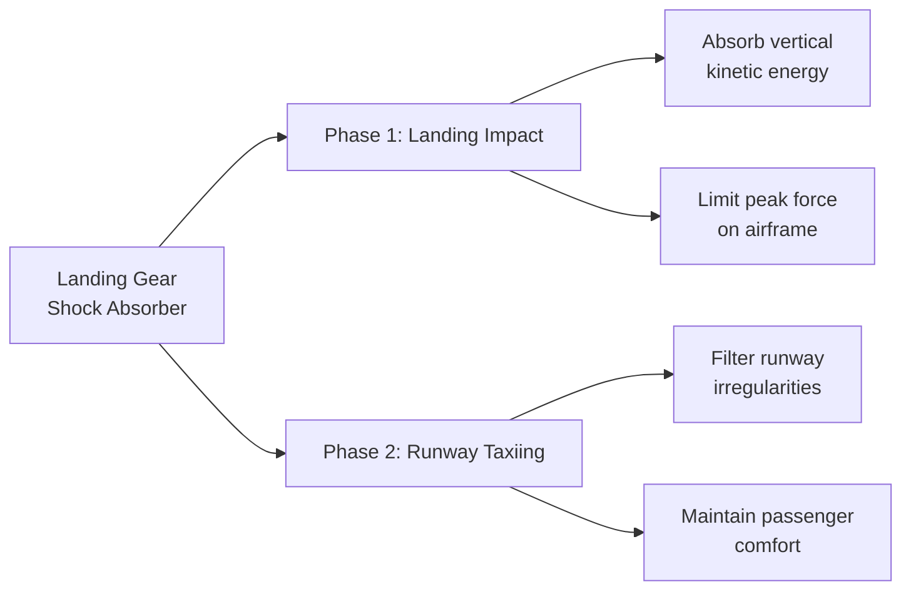
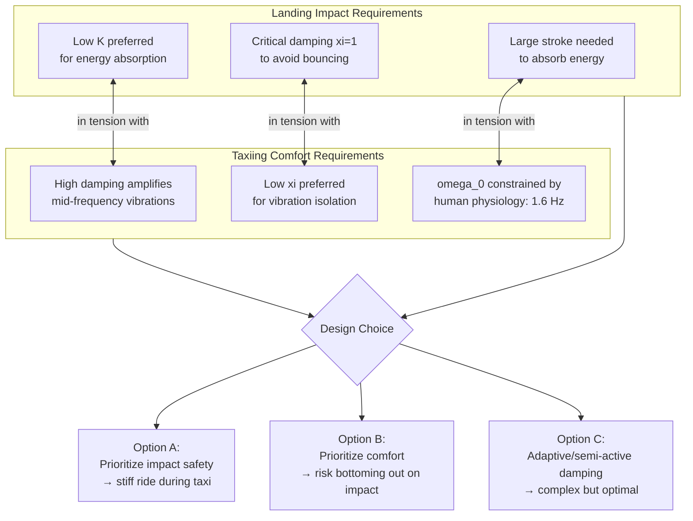

# Aircraft Landing Gear Shock Absorber: The Impact-Comfort Tradeoff

## Executive Summary

An aircraft landing gear shock absorber serves two conflicting missions: **(1) absorb the violent impact of landing** without damaging the airframe, and **(2) filter runway irregularities during taxiing** for passenger comfort. This analysis demonstrates, through transfer function modeling and frequency-domain analysis, that these two requirements pull the same design parameters in opposite directions. A shock absorber optimized for landing impact will necessarily compromise taxiing comfort — and vice versa. Understanding this tradeoff is fundamental to landing gear design and illustrates a broader engineering principle: **multi-mission systems rarely have a single optimal configuration.**

> **Python simulation:** [simulation.ipynb](./simulation.ipynb) — Jupyter notebook with impulse response, Bode diagrams, passenger comfort analysis, and interactive parameter sweep. Open in VS Code, Jupyter Lab, or view directly on GitHub.

---

## 1. System Context

### The Two Operating Phases



During **landing impact**, the aircraft descends with significant vertical velocity. The shock absorber must dissipate this energy over a limited stroke length while keeping the peak force transmitted to the airframe within structural limits. The input is an impulsive vertical force $F_V(t)$; the output of interest is the vertical displacement of the aircraft body $z_a(t)$.

During **runway taxiing**, the aircraft rolls over concrete slab joints, surface roughness, and other irregularities. The shock absorber must isolate the cabin from these high-frequency perturbations. The input is the runway profile height $z_p(t)$; the output of interest is the vertical acceleration experienced by passengers $\ddot{z}_a(t)$.

### Why one system cannot excel at both

The same physical parameters — spring stiffness $K$ and damping coefficient $c$ — govern both phases. Tuning them for impact absorption degrades vibration isolation, and vice versa. This is not a failure of design but a **fundamental physical constraint**.

---

## 2. Physical Model

The landing gear is modeled as a single-degree-of-freedom mass-spring-damper system:

```
                    ┌──────────────┐
                    │  Airframe    │
                    │  mass M_e    │
                    └──────┬───────┘
                           │ z_a(t)
                    ┌──────┴───────┐
                    │   Spring K   │────┐
                    │   Damper c   │────┤ parallel
                    └──────┬───────┘    │
                           │            │
                    ┌──────┴───────┐    │
                    │  Wheel/Tire  │<───┘
                    └──────┬───────┘
                           │
              ┌────────────┴────────────┐
              │  Runway surface z_p(t)  │
              └─────────────────────────┘
```

### Parameters

| Symbol | Description | Role |
|--------|------------|------|
| $M_e$ | Equivalent suspended mass | Inertia of the airframe supported by this gear |
| $K$ | Spring stiffness | Determines natural frequency $\omega_0 = \sqrt{K/M_e}$ |
| $c$ | Damping coefficient | Dissipates energy; characterized by damping ratio $\xi$ |
| $\omega_0$ | Natural pulsation | Key design parameter — constrained by human physiology |
| $\xi$ | Damping ratio | $\xi = c / (2\sqrt{K M_e})$ — determines response regime |

---

## 3. Impact Phase Analysis

### Transfer Function

Applying Newton's Second Law (PFD — Principe Fondamental de la Dynamique) to the suspended mass:

$$M_e \cdot \ddot{z}_a(t) = -K \cdot z_a(t) - c \cdot \dot{z}_a(t) + F_V(t)$$

Taking the Laplace transform under zero initial conditions:

$$H_1(p) = \frac{Z_a(p)}{F_V(p)} = \frac{1}{K + c p + M_e p^2}$$

In canonical second-order form:

$$H_1(p) = \frac{G_0}{1 + \frac{2\xi}{\omega_0}p + \frac{1}{\omega_0^2}p^2}$$

Where:
- **Static gain** $G_0 = 1/K$ — the displacement per unit force at steady state
- **Natural pulsation** $\omega_0 = \sqrt{K/M_e}$
- **Damping ratio** $\xi = c / (2\sqrt{K M_e})$

### The Human Constraint

> The human body tolerates vertical excitations best around **1.6 Hz**.

This physiological fact fixes $\omega_0$:

$$\omega_0 = 2\pi \cdot 1.6 \approx 10 \text{ rad/s}$$

Consequently, the stiffness is no longer a free variable — it is determined by the aircraft mass:

$$K = M_e \cdot \omega_0^2$$

### Impact Response

The landing impact is modeled as an impulse:

$$F_V(t) = n \cdot M_e \cdot g \cdot \delta(t)$$

Where $n$ is the load factor. The impulse response reveals the peak displacement (stroke) required. With the damping ratio set to **critical damping** ($\xi = 1$), the system returns to equilibrium without oscillation — desirable for impact, as it avoids bouncing.

**Key observation:** Critical damping ($\xi = 1$) is optimal for absorbing a single large impulse. The system dissipates energy as quickly as possible without overshoot.

---

## 4. Taxiing Phase Analysis

### Transfer Function

With the runway profile $z_p(t)$ as input and aircraft displacement $z_a(t)$ as output, including tire stiffness $k_p$:

$$H_2(p) = \frac{Z_a(p)}{Z_p(p)} = \frac{k_p + c p}{k_p + K + c p + M_e p^2}$$

This is a second-order system with a **zero** (numerator dynamics), which fundamentally changes the frequency response compared to the impact transfer function.
This can be reduced to the form:

$$H_2(p) = \frac{1 + 0.2p}{(1 + 0.1p)^2}$$

### Bode Diagram Analysis

```mermaid
flowchart TD
    A[Runway Input<br>zp(t)] --> B[H2(p)<br>Shock Absorber]
    B --> C[za(t)<br>Cabin Displacement]
    C --> D[H3(p)<br>Acceleration Filter]
    D --> E[za_ddot(t)<br>Passenger Acceleration]

    F[Norm NF E90-401-2<br>Human Vibration Tolerance] -.->|constrains| E
```

#### Low-frequency behavior ($p \to 0$)

$H_2(p) \to \frac{k_p}{k_p + K}$, a constant gain. At very low speeds (long-wavelength undulations), the cabin follows the runway profile faithfully — the suspension is effectively rigid. **Passengers feel the full amplitude of slow undulations.**

#### Resonance region

The system exhibits a **resonant peak** at a specific pulsation $\omega_r$, where the gain exceeds unity. At the corresponding taxiing speed, runway irregularities are **amplified** before reaching the cabin:

$$Q_S = \left|H_2(j\omega_r)\right| > 1$$

For the given parameters, this resonance occurs at a taxiing speed that falls squarely within normal operational range.

#### High-frequency behavior ($p \to +\infty$)

$H_2(p) \to 0$ — the suspension effectively isolates the cabin from high-frequency roughness. This is the regime where the shock absorber actually works well for comfort.

---

## 5. The Core Tradeoff



### Detailed Conflict Analysis

| Design Parameter | Impact Phase Needs | Taxiing Phase Needs | Conflict? |
|-----------------|-------------------|--------------------|-----------|
| Stiffness $K$ | Low — to absorb energy over longer stroke | Constrained by $\omega_0$ = 10 rad/s | **Yes** — $\omega_0$ fixes $K$ for a given $M_e$ |
| Damping $\xi$ | $\xi = 1$ (critical) — fastest energy dissipation, no bounce | $\xi < 1$ — lower damping reduces mid-frequency amplification | **Yes** — a single fixed damper cannot serve both |
| Stroke length | As large as possible | Limited by mechanical packaging and weight | **Indirect** — longer stroke = heavier system |

### Why damping is the central tension

The damping ratio $\xi$ has opposite effects in the two regimes:

- **Impact:** Higher $\xi$ → faster energy dissipation → lower peak force on airframe → **better**
- **Taxiing:** Higher $\xi$ → stiffer coupling between wheel and cabin → more vibration transmitted → **worse**

A single fixed hydraulic damper cannot reconcile these. This is why modern aircraft increasingly use **semi-active or active damping** — allowing different damping characteristics in different phases.

---

## 6. Passenger Comfort: The Hard Constraint

The French standard **NF E90-401-2** defines human tolerance to vertical vibration. It identifies two critical zones:

| Zone | Frequency Range | Effect |
|------|----------------|--------|
| Zone A | 4–8 Hz (peak sensitivity) | Motion sickness — "mal des transports" |
| Zone B | Broader range | Vibratory discomfort — "inconfort vibratoire" |

The acceleration transfer function links runway input to passenger acceleration:

$$\frac{\ddot{Z}_a(p)}{Z_p(p)} = p^2 \cdot H_2(p) \cdot H_3(p)$$

Where $H_3(p)$ is a second-order filter with $\omega_1 = 300$ rad/s and $\xi_1 = 0.1$.

For a typical runway irregularity amplitude $z_{p0} = 1$ cm, the acceleration $\ddot{z}_{a0}$ experienced by passengers in the 4–8 Hz band is compared against the standard. The analysis shows that the acceleration **exceeds comfort thresholds** in this critical frequency range — directly because the damping value chosen for impact safety is suboptimal for vibration isolation.

---

## 7. Engineering Conclusion

### The fundamental insight

The aircraft landing gear shock absorber embodies a **Pareto front** — you cannot simultaneously maximize impact absorption and taxiing comfort with a passive, single-mode system. Every design point represents a compromise.

### How real systems address this

| Approach | Description | Adoption |
|----------|------------|----------|
| **Fixed orifice damper** | Single damping coefficient, optimized for the more safety-critical phase (impact) | Legacy / smaller aircraft |
| **Multi-stage orifice** | Different damping at different stroke positions — passive but more flexible | Common in commercial aviation |
| **Semi-active damper** | Electronically adjustable damping via magnetorheological fluid or variable orifice | Growing adoption (e.g., Boeing 787) |
| **Active suspension** | Fully powered actuation with real-time control | Research stage for landing gear |

### What I learned

This analysis demonstrates a pattern that recurs across industrial systems: **multi-objective optimization under conflicting requirements**. As a technical sales engineer, recognizing this pattern means I can:

1. Understand *why* a product makes specific design choices
2. Explain to customers the tradeoffs behind performance specifications
3. Anticipate where a competitor's "better" number in one dimension implies a sacrifice elsewhere

---

## Appendix: Mathematical Derivations

### A.1 Transfer Function $H_1(p)$ — Impact Phase

From Newton's Second Law on the suspended mass $M_e$:

$$M_e \ddot{z}_a(t) + c \dot{z}_a(t) + K z_a(t) = F_V(t)$$

Laplace transform (Heaviside conditions):

$$(M_e p^2 + c p + K) Z_a(p) = F_V(p)$$

$$\boxed{H_1(p) = \frac{Z_a(p)}{F_V(p)} = \frac{1}{M_e p^2 + c p + K}}$$

Canonical form:

$$\boxed{H_1(p) = \frac{1/K}{1 + \frac{2\xi}{\omega_0}p + \frac{1}{\omega_0^2}p^2}}$$

### A.2 Natural Frequency Constraint

Human physiology dictates optimal vertical excitation at $f_0 = 1.6$ Hz:

$$\omega_0 = 2\pi f_0 = 2\pi \cdot 1.6 \approx 10 \text{ rad/s}$$

Therefore:

$$K = M_e \cdot \omega_0^2 = M_e \cdot 100$$

### A.3 Critical Damping

Critical damping occurs when the characteristic polynomial has a double real root:

$$\Delta = (2\xi/\omega_0)^2 - 4/\omega_0^2 = 0 \implies \xi = 1$$

With $\xi = 1$, the impulse response shows no oscillation and the fastest possible return to equilibrium — ideal for single-impact events.

---

## References

- NF E90-401-2: Mechanical vibration and shock — Evaluation of human exposure to whole-body vibration (AFNOR)
- Boeing 787 landing gear system technical documentation (public domain excerpts)
- Python simulation: scipy.signal, matplotlib — see [simulation.ipynb](./simulation.ipynb)

---

*Part of the [Industrial Systems Analysis](../) series by [@julietteC06](https://github.com/julietteC06)*
