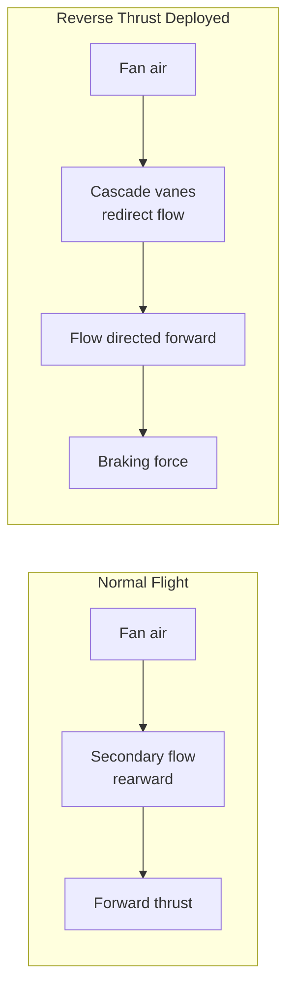
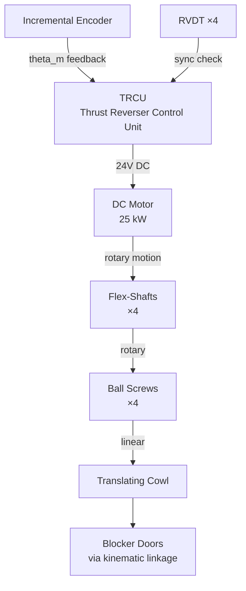
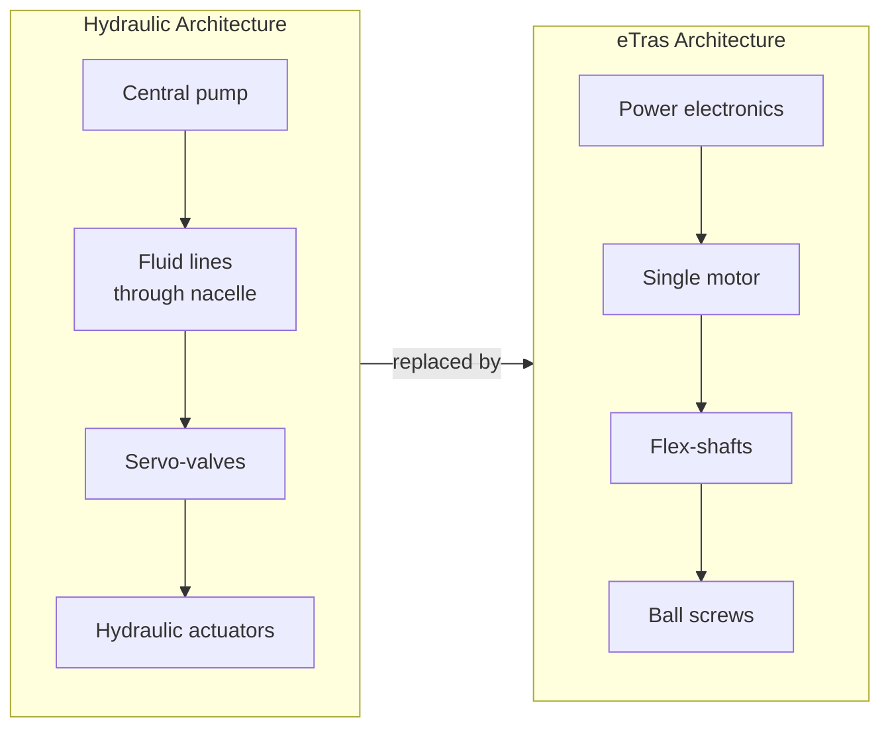
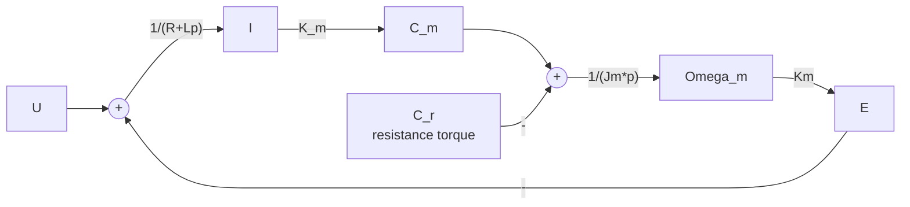
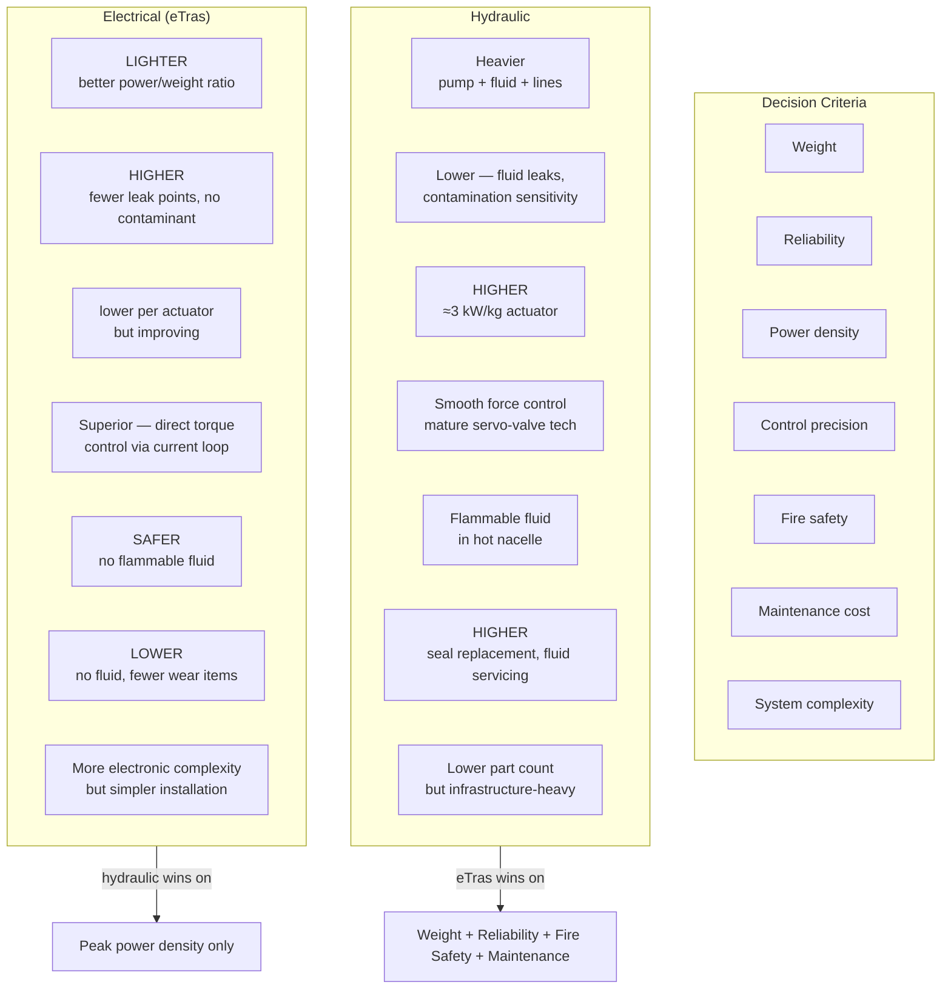

# eTras: The First Electrical Thrust Reverser — Why Eliminate Hydraulics from the Engine Nacelle?

## Executive Summary

The Safran eTras (Electrical Thrust Reverser Actuation System) is the first fully electrical thrust reverser actuation system in commercial aviation. It replaces a traditional hydraulic circuit — pumps, fluid lines, actuators — with a single 25 kW DC motor driving four synchronized ball-screw mechanisms through flexible shafts. This analysis examines **why the hydraulic-to-electric transition matters**, models the motor control architecture, designs the PI current controller, and evaluates the engineering tradeoffs: weight, reliability, maintenance, and control precision. The central insight is that the decision to go electric is not purely about performance — it is a **system-level optimization** driven by the elimination of failure-prone hydraulic infrastructure from a fire-critical engine zone.

---

## 1. System Context

### What is a thrust reverser?

On landing, an aircraft needs to decelerate from touchdown speed (~250 km/h) to taxi speed. Wheel brakes do most of the work, but a **thrust reverser** contributes additional braking by redirecting the engine's bypass airflow forward — creating reverse thrust.



When deployed, a translating cowl slides aft, blocker doors pivot into the bypass duct, and cascade vanes expose to redirect the airflow forward. The mechanism must translate the nacelle's outer structure smoothly and synchronously — this is the actuation problem eTras solves.

### Why it's safety-critical

The thrust reverser must **never** deploy inadvertently in flight. It must also deploy reliably on landing, even under single-failure conditions. The actuation system lives inside the engine nacelle — an environment of extreme vibration, temperature cycling, and fire risk. This context defines every engineering decision.

---

## 2. The Innovation: Electrical Actuation

### The old way: hydraulics

Traditional thrust reversers use a **hydraulic actuation system**:
- Hydraulic fluid pumped at high pressure (~3000 psi / 207 bar)
- Hydraulic lines routed through the nacelle to actuators
- Hydraulic actuators driving the translating cowl
- Servo-valves controlling the flow

### The new way: eTras



**Key components:**
- **TRCU** (Thrust Reverser Control Unit): Power electronics + controller, converts 115V AC (360–800 Hz from engine generator) to 24V DC
- **Single 25 kW DC motor**: The sole prime mover
- **4 flex-shafts**: Flexible rotary shafts transmitting power while accommodating nacelle geometry and vibration
- **4 ball-screw mechanisms**: Convert rotary motion → linear translation of the cowl
- **Incremental encoder**: Motor shaft angular position feedback
- **4 RVDT sensors** (Rotary Variable Differential Transformer): Verify synchronization of all 4 screw mechanisms

### The architecture decision



Eliminating hydraulics from the nacelle means:
- No flammable hydraulic fluid near hot engine components → **reduced fire risk**
- No high-pressure lines that can leak → **improved reliability**
- No hydraulic pump loading the engine → **fuel savings**
- Lighter system → **weight savings** (electric actuators have better power-to-weight ratio)

---

## 3. DC Motor Modeling

### Physical model

The DC motor is modeled by three equations coupling the electrical and mechanical domains:

**Electrical equation:**
$$u(t) = e(t) + R \cdot i(t) + L \cdot \frac{di(t)}{dt}$$

**Electromechanical coupling:**
$$C_m(t) = K_m \cdot i(t) \quad\text{(torque proportional to current)}$$
$$e(t) = K_m \cdot \omega_m(t) \quad\text{(back-EMF proportional to speed)}$$

**Mechanical equation (PFD):**
$$J_m \cdot \frac{d\omega_m(t)}{dt} = C_m(t) - C_r(t)$$

Where:
| Symbol | Meaning |
|--------|---------|
| $u(t)$ | Motor terminal voltage |
| $i(t)$ | Armature current |
| $R, L$ | Armature resistance and inductance |
| $K_m$ | Torque/back-EMF constant |
| $C_m(t)$ | Motor torque |
| $C_r(t)$ | Load (resistive) torque |
| $\omega_m(t)$ | Motor angular velocity |
| $J_m$ | Equivalent moment of inertia on motor shaft |

### Transfer function block diagram



The electrical time constant $\tau_e = L/R$ and mechanical time constant $\tau_m = J_m / (K_m^2/R)$ define the motor's dynamic response. For a 25 kW aerospace motor, $\tau_e \ll \tau_m$ — the electrical dynamics are much faster.

---

## 4. Current Servo Loop (Torque Control)

### Why control current?

Motor torque $C_m = K_m \cdot i(t)$ — so controlling current **is** controlling torque. A torque servo loop ensures:
- Precise force delivery at the ball screws
- Protection against overcurrent (motor safety)
- Rejection of load disturbances ($C_r$) from aerodynamic forces on the cowl

### Control architecture

```mermaid
flowchart LR
    Ic[I_c<br>current setpoint] --> SUM1((+))
    SUM1 -->|ε| C[PI Controller<br>C(p)]
    C -->|U_cmd| Ka[K_a<br>adapter]
    Ka -->|U_m| Motor[Motor<br>locked rotor]
    Motor -->|I| Re[R_e<br>current sensor]
    Re -->|U_mes| SUM1
```

The adapter gain $K_a$ is set so that $\varepsilon_U = 0$ when $i(t) = i_c(t)$:
$$K_a = R_e$$

### Open-loop transfer function (locked rotor)

With the rotor blocked ($C_r = 0$, $\omega_m = 0 \implies e = 0$), the electrical dynamics reduce to a first-order system:

$$FTBO(p) = \frac{U_{mes}(p)}{\varepsilon_U(p)} = \frac{K_a \cdot C(p) \cdot R_e}{R + Lp}$$

The time constant $\tau_e = L/R$ is the electrical pole that limits bandwidth.

---

## 5. PI Controller Design

### Why PI (Proportional-Integral)?

A PI controller:
$$C(p) = K_p \cdot \frac{1 + \tau_i p}{\tau_i p}$$

- The **proportional** action ($K_p$) sets the response speed
- The **integral** action ($1/\tau_i p$) guarantees **zero steady-state error** — the current will exactly track the setpoint

### Pole compensation strategy

The PI controller is tuned to **cancel the electrical pole**:

$$\tau_i = \tau_e = L/R$$

This is the "pole-zero cancellation" or "compensation method." The open-loop transfer function becomes:

$$FTBO(p) = \frac{K_p \cdot K_a \cdot R_e}{R \cdot \tau_i p} = \frac{K_{BO}}{p}$$

After compensation, the system behaves as a **pure integrator** — infinite DC gain (zero error), -20 dB/decade slope, and -90° phase across all frequencies. The gain $K_p$ is then chosen to set the desired closed-loop bandwidth.

### Performance verification

The compensated system must satisfy:
| Requirement | Criterion |
|------------|-----------|
| Stability | Phase margin $M_\varphi \geq 45°$ |
| Precision | Zero steady-state error (class 1 system) |
| Speed | Bandwidth sufficient for thrust reverser deployment time specs |

With PI compensation, the system achieves the stability and precision targets while bandwidth is limited by the mechanical resonance of the flex-shaft / ball-screw assembly — a constraint that a hydraulic system shares.

---

## 6. The Core Tradeoff: Hydraulic vs. Electrical Actuation



### The decisive factor: fire safety

In the nacelle, fire safety is paramount. Hydraulic fluid (Skydrol or similar) is flammable under engine fire conditions. **Eliminating it from the nacelle is not an incremental improvement — it removes an entire hazard class.** This single factor makes the electrical architecture strategically superior, even before considering weight and maintenance advantages.

### The compromise: power density

Hydraulic actuators deliver higher instantaneous power density (~3 kW/kg vs. ~1–2 kW/kg for electromechanical). However, this gap is narrowing, and for the thrust reverser application — a few-second deployment, a few times per flight — 25 kW is sufficient with a properly sized motor.

---

## 7. Engineering Conclusion

### The design philosophy

The eTras exemplifies a broader trend in aerospace: **the More Electric Aircraft (MEA)**. By replacing hydraulic and pneumatic systems with electrical alternatives, aircraft become lighter, more reliable, and easier to maintain. The thrust reverser was a logical target because:

1. It operates intermittently (no continuous duty)
2. The nacelle is a fire-critical zone where hydraulic fluid is a liability
3. Electrical control enables finer synchronization (4-screw coordination via encoder + RVDT feedback)
4. The single-motor / multi-actuator architecture with flex-shafts elegantly solves the geometric constraints

### Why this analysis matters for a sales engineer

When discussing the eTras with a customer (an airline or aircraft manufacturer), the conversation isn't about transfer functions — it's about:

> "Yes, the electrical system is a new technology with less service history. But it eliminates the single largest fire risk in your nacelle, removes 40 kg of hydraulic infrastructure per engine, and cuts turnaround maintenance by eliminating fluid servicing. The PI current control loop means the system adapts to wear over the component lifetime — unlike a hydraulic servo-valve that requires periodic recalibration."

**That's the translation from engineering analysis to customer value.** The models and derivations in this document are the foundation; the ability to articulate the tradeoff in business terms is the skill.

---

## Appendix: Mathematical Derivations

### A.1 DC Motor Transfer Functions

From the electrical equation in the Laplace domain:

$$U(p) = E(p) + (R + Lp) \cdot I(p)$$

With $E(p) = K_m \cdot \Omega_m(p)$:

$$I(p) = \frac{U(p) - K_m \cdot \Omega_m(p)}{R + Lp}$$

From the mechanical equation:

$$J_m p \cdot \Omega_m(p) = K_m \cdot I(p) - C_r(p)$$

Eliminating $\Omega_m(p)$ yields the four motor transfer functions:

$$\boxed{H_{UI}(p) = \frac{I(p)}{U(p)}\bigg|_{C_r=0} = \frac{J_m p}{J_m L p^2 + J_m R p + K_m^2}}$$

$$\boxed{H_{U\Omega}(p) = \frac{\Omega_m(p)}{U(p)}\bigg|_{C_r=0} = \frac{K_m}{J_m L p^2 + J_m R p + K_m^2}}$$

### A.2 Adapter Gain for Zero Error

At steady state with $i(t) = i_c(t)$:

$$\varepsilon_U = K_a \cdot i_c - R_e \cdot i = (K_a - R_e) \cdot i_c$$

Setting $\varepsilon_U = 0$:
$$\boxed{K_a = R_e}$$

### A.3 PI Pole Compensation

With locked rotor and PI controller $C(p) = K_p(1 + \tau_i p)/(\tau_i p)$:

$$FTBO(p) = \frac{K_a \cdot K_p(1+\tau_i p) \cdot R_e}{\tau_i p \cdot (R + Lp)}$$

Choosing $\tau_i = L/R$ cancels the electrical pole $(R+Lp)$:

$$FTBO(p) = \frac{K_a \cdot K_p \cdot R_e}{\tau_i \cdot R \cdot p} = \frac{K_{BO}}{p}$$

The compensated open-loop is a pure integrator — guaranteeing **zero steady-state error** (class 1 servo) with -90° phase margin.

---

## References

- Safran Nacelles — eTras product brochure and public technical documentation
- Safran technical publications: Electrical Thrust Reverser Actuation System overview
- More Electric Aircraft (MEA) initiative — Boeing 787 and Airbus A380 electrical architecture whitepapers
- DC motor control theory: standard servo-loop design references (PI compensation, pole-zero cancellation)

---

*Part of the [Industrial Systems Analysis](../) series by [@julietteC06](https://github.com/julietteC06)*
